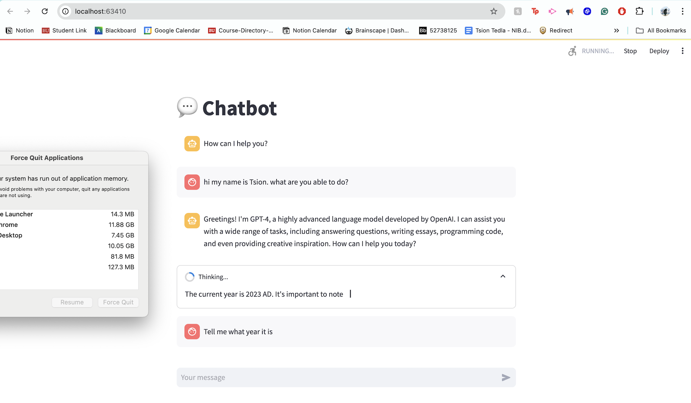

## Tsion - Assignment 7

### I ran the Chatbot!

Here is my Chatbot Screenshot:

#### What Went Well:

I was able to get the chatbot started! That was a feat on its own, so the fact that it started and ran at all is one thing that went well.

#### What Didn't Go Well:

Initially, when trying to open the chatbot, it took me to "http://localhost:63410/" but then I encountered an error indicating it failed to connect. I was eventually able to get it running, although I'm unsure how; I just kept restarting it, and it worked on the nth attempt. The chatbot takes a verrrry long time to produce answers. I can see it "thinking" and writing its answer essentially letter by letter. I thought perhaps the question I asked ("What are you able to do?") was too complex, which might have caused the delay, but then I asked what year it was and it still took a considerable amount of time to answer. It actually ended up freezing and not giving me a full answer but it told me the current year was 2023, although perhaps maybe it doesn't have access to real-time data yet, and maybe its data is updated only up to 2023, but i feel like the date is simple enough to figure out even w/out real-time-data. Additionally, I kept receiving a "force to quit applications" warning because Podman consumed so much memory. ​Overall, I don’t think it’s usable for me; perhaps I don't have the right computer for it.​
